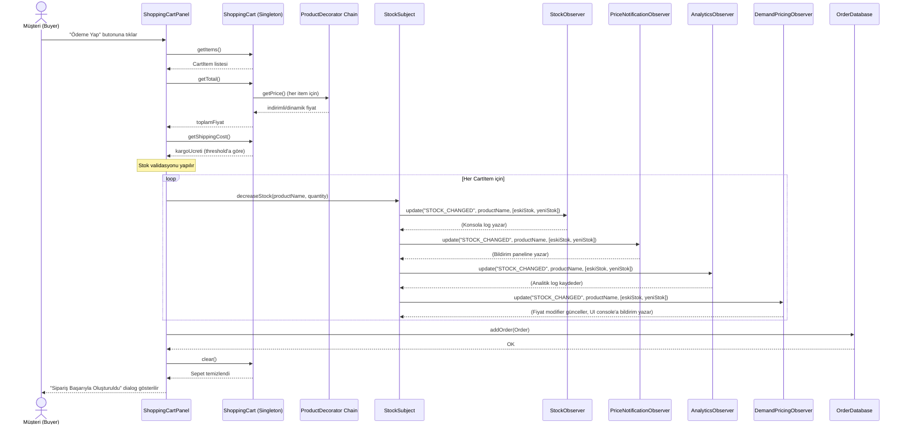
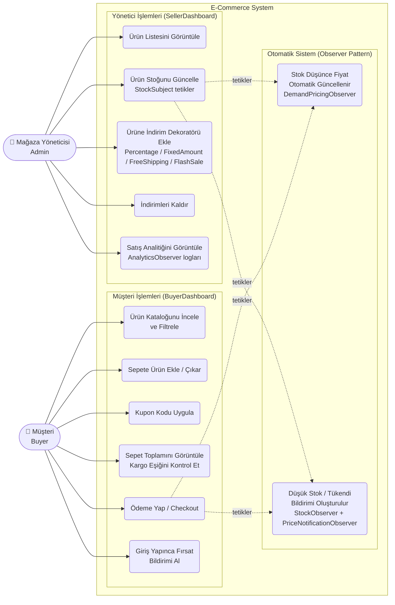

# CLASS DIAGRAM

```mermaid
classDiagram

    %% ── SINGLETON PATTERN ──
    class AppConfig {
        -static AppConfig instance
        -String appName
        -String currency
        -double defaultShippingCost
        -int lowStockThreshold
        -boolean notificationsEnabled
        -AppConfig()
        +static getInstance() AppConfig
        +getDefaultShippingCost() double
        +getLowStockThreshold() int
        +isNotificationsEnabled() boolean
    }

    class SessionManager {
        -static User currentUser
        -SessionManager()
        +static login(User)
        +static logout()
        +static getCurrentUser() User
        +static getCurrentBuyer() Buyer
        +static getCurrentSeller() Seller
        +static isBuyer() boolean
        +static isSeller() boolean
    }

    class ShoppingCart {
        -static Map~Integer, ShoppingCart~ instances
        -List~CartItem~ items
        -ShoppingCart(userId)
        +static getInstance(userId) ShoppingCart
        +addItem(ProductComponent, Product)
        +removeItem(int)
        +updateQuantity(int, int)
        +getTotal() double
        +getShippingCost() double
        +getGrandTotal() double
        +getQuantity(Product) int
        +clear()
    }

    %% ── OBSERVER PATTERN ──
    class Observer {
        <<interface>>
        +update(eventType String, productName String, data Object)
    }

    class StockSubject {
        -Map~String, Integer~ stockMap
        -List~Observer~ observers
        +addObserver(Observer)
        +decreaseStock(productName, qty)
        +setStock(productName, qty)
        +getStock(productName) int
        -notifyObservers(eventType, productName, data)
    }

    class StockObserver {
        +update(eventType, productName, data)
    }

    class PriceNotificationObserver {
        -List~String~ notifications
        -List~NotificationListener~ listeners
        +update(eventType, productName, data)
        +addListener(NotificationListener)
    }

    class AnalyticsObserver {
        -List~String~ eventLog
        +update(eventType, productName, data)
        +getFormattedLog() List~String~
        +getTotalEventCount() int
    }

    class DemandPricingObserver {
        -static Map~String, Double~ priceModifiers
        -static List~NotificationListener~ listeners
        +update(eventType, productName, data)
        +static getModifier(productName) double
        +static addListener(NotificationListener)
    }

    StockSubject "1" o-- "0..*" Observer : notifies
    Observer <|.. StockObserver
    Observer <|.. PriceNotificationObserver
    Observer <|.. AnalyticsObserver
    Observer <|.. DemandPricingObserver

    %% ── DECORATOR PATTERN ──
    class ProductComponent {
        <<interface>>
        +getPrice() double
        +getDescription() String
        +hasFreeShipping() boolean
        +getName() String
        +getStock() int
    }

    class Product {
        -int id
        -String name
        -String description
        -double price
        -int stock
        -String category
        -int sellerId
        +getPrice() double
        +getDescription() String
        +hasFreeShipping() boolean
    }

    class ProductDecorator {
        <<abstract>>
        #ProductComponent decorated
        +ProductDecorator(ProductComponent)
        +getPrice() double
        +getDescription() String
        +hasFreeShipping() boolean
    }

    class PercentageDiscountDecorator {
        -double discountPercent
        +getPrice() double
        +getDescription() String
    }

    class FixedAmountDiscountDecorator {
        -double discountAmount
        +getPrice() double
        +getDescription() String
    }

    class FreeShippingDecorator {
        +hasFreeShipping() boolean
        +getDescription() String
    }

    class FlashSaleDecorator {
        +getPrice() double
        +getDescription() String
    }

    class DynamicPricingDecorator {
        +getPrice() double
        +getDescription() String
    }

    ProductComponent <|.. Product
    ProductComponent <|.. ProductDecorator
    ProductDecorator o-- ProductComponent : wraps
    ProductDecorator <|-- PercentageDiscountDecorator
    ProductDecorator <|-- FixedAmountDiscountDecorator
    ProductDecorator <|-- FreeShippingDecorator
    ProductDecorator <|-- FlashSaleDecorator
    ProductDecorator <|-- DynamicPricingDecorator

    %% ── MODEL RELATIONS ──
    class User {
        <<abstract>>
        #int id
        #String name
        #String email
        #String password
        +authenticate(email, password) boolean
        +getRole() Role
    }

    class Buyer {
        -double freeShippingThreshold
        +getFreeShippingThreshold() double
        +getShoppingCart() ShoppingCart
        +getRole() Role
    }

    class Seller {
        -String storeName
        +getStoreName() String
        +getRole() Role
    }

    User <|-- Buyer
    User <|-- Seller
    Buyer ..> ShoppingCart : uses getInstance()
    SessionManager ..> User : manages
```

---

# SEQUENCE DIAGRAM

```mermaid
sequenceDiagram
    actor Buyer as Müşteri (Buyer)
    participant UI as ShoppingCartPanel
    participant Cart as ShoppingCart (Singleton)
    participant Deco as ProductDecorator Chain
    participant Stock as StockSubject
    participant SO as StockObserver
    participant PN as PriceNotificationObserver
    participant AN as AnalyticsObserver
    participant DP as DemandPricingObserver
    participant ODB as OrderDatabase

    Buyer->>UI: "Ödeme Yap" butonuna tıklar
    UI->>Cart: getItems()
    Cart-->>UI: CartItem listesi

    UI->>Cart: getTotal()
    Cart->>Deco: getPrice() (her item için)
    Deco-->>Cart: indirimli/dinamik fiyat
    Cart-->>UI: toplamFiyat

    UI->>Cart: getShippingCost()
    Cart-->>UI: kargoUcreti (threshold'a göre)

    Note over UI: Stok validasyonu yapılır

    loop Her CartItem için
        UI->>Stock: decreaseStock(productName, quantity)
        Stock->>SO: update("STOCK_CHANGED", productName, [eskiStok, yeniStok])
        SO-->>Stock: (Konsola log yazar)
        Stock->>PN: update("STOCK_CHANGED", productName, [eskiStok, yeniStok])
        PN-->>Stock: (Bildirim paneline yazar)
        Stock->>AN: update("STOCK_CHANGED", productName, [eskiStok, yeniStok])
        AN-->>Stock: (Analitik log kaydeder)
        Stock->>DP: update("STOCK_CHANGED", productName, [eskiStok, yeniStok])
        DP-->>Stock: (Fiyat modifier günceller, UI console'a bildirim yazar)
    end

    UI->>ODB: addOrder(Order)
    ODB-->>UI: OK

    UI->>Cart: clear()
    Cart-->>UI: Sepet temizlendi

    UI-->>Buyer: "Sipariş Başarıyla Oluşturuldu" dialog gösterilir
```

---

# USE CASE DIAGRAM

```mermaid
flowchart LR
    Buyer([🛒 Müşteri\nBuyer])
    Admin([🏪 Mağaza Yöneticisi\nAdmin])

    subgraph System["E-Commerce System"]
        direction TB

        subgraph BuyerUC["Müşteri İşlemleri (BuyerDashboard)"]
            UC1(Ürün Kataloğunu İncele\nve Filtrele)
            UC2(Sepete Ürün Ekle / Çıkar)
            UC3(Kupon Kodu Uygula)
            UC4(Sepet Toplamını Görüntüle\nKargo Eşiğini Kontrol Et)
            UC5(Ödeme Yap / Checkout)
            UC6(Giriş Yapınca Fırsat\nBildirimi Al)
        end

        subgraph AdminUC["Yönetici İşlemleri (SellerDashboard)"]
            UC7(Ürün Listesini Görüntüle)
            UC8(Ürün Stoğunu Güncelle\nStockSubject tetikler)
            UC9(Ürüne İndirim Dekoratörü Ekle\nPercentage / FixedAmount / FreeShipping / FlashSale)
            UC10(İndirimleri Kaldır)
            UC11(Satış Analitiğini Görüntüle\nAnalyticsObserver logları)
        end

        subgraph AutoUC["Otomatik Sistem (Observer Pattern)"]
            UC12(Stok Düşünce Fiyat\nOtomatik Güncellenir\nDemandPricingObserver)
            UC13(Düşük Stok / Tükendi\nBildirimi Oluşturulur\nStockObserver + PriceNotificationObserver)
        end
    end

    Buyer --> UC1
    Buyer --> UC2
    Buyer --> UC3
    Buyer --> UC4
    Buyer --> UC5
    Buyer --> UC6

    Admin --> UC7
    Admin --> UC8
    Admin --> UC9
    Admin --> UC10
    Admin --> UC11

    UC8 -.->|tetikler| UC12
    UC8 -.->|tetikler| UC13
    UC5 -.->|tetikler| UC12
    UC5 -.->|tetikler| UC13
```
